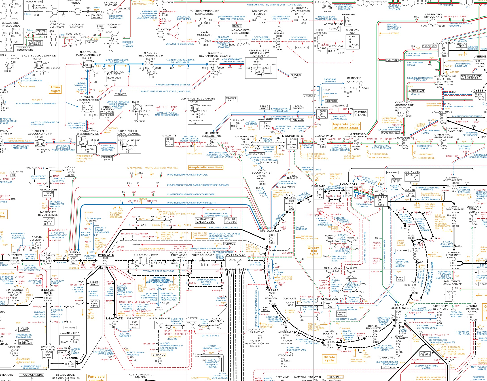

# Biochemical Pathways Poster

After officially shutting down print production of its famous biochemical pathways posters, Roche made the posters available via a [nifty online interface](http://biochemical-pathways.com/#/map/1). Unfortunately, this has left people who want a paper copy without a good option. This script will download and assemble the Metabolic Pathways poster from the tiles hosted on their server to give you a large, printable PNG file.

## Requirements
You will need the following requirements:
* `Python > 3.5.2`
* [ImageMagick](http://www.imagemagick.org/script/index.php).

The script will run on OSX and linux machines. Windows was not tested, yet.

Install the requirements in `requirements.txt` by running

```bash
pip install -r requirements.txt
```




## Usage

run the script from the command line using
```bash
python extract_metabol.py
```

if python2 is installed, along with python3, make sure to call the script using python3.
```bash
python3 extract_metabol.py
```

This will dump all the raw tiles in `images/`, assembled layers in `assembled/`, and the final image `finalimg.png` in the root directory.

### options
* Specify the zoom level by changing `zoomLevel` at the beginning of `extract_metabol.py`.
* If you want to have the original grid, comment out the line that removes grid from the array in the beginning of `extract_metabol.py`.

### Pre-Compiled Images
- [high-quality PNG (13654 x 9571 px)](prebuilt_hires.png)
- [low-quality JPEG](prebuilt_lores.jpg)

## Future features
- Printable part 2: cellular mechanisms
